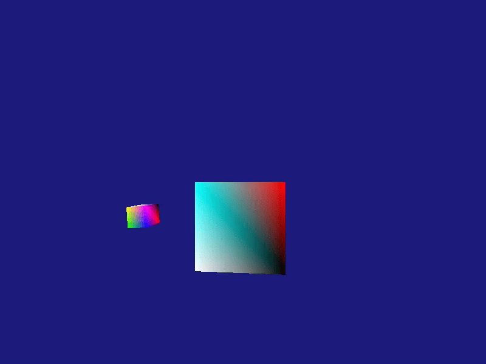
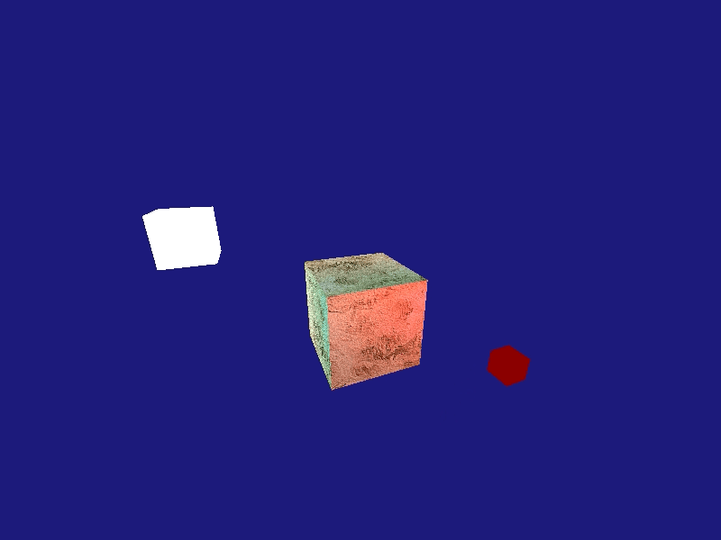
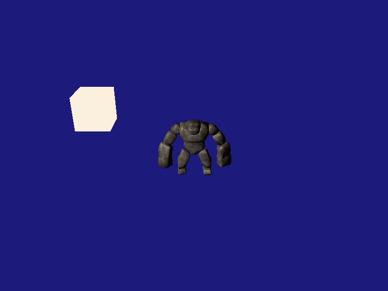

# DirectX11 Renderer
> <samp>[2023-1] Game Graphic Programming LAB & Assignment ✘</samp><code>2023.3.14 ~ 2023.6.18</code>  
> <samp>based on Windows API, D3D11, C/C++, Visual Studio 2022, Windows 10</samp>

## Preview 🐟
<code>[LAB01] D3D Setting</code>

<code>[LAB02] Rendering a Triangle</code> 

<code>[LAB03] 3D Space and Transformation</code> <br>


<code>[LAB04] Texture Mapping and Constant Buffers</code> <br>


<code>[LAB05] Lighting</code> <br>


<code>[LAB07] Object-Oriented Design</code>

<code>[LAB08] Model Loading (Assimp)</code> <br>


<code>[LAB09] Character Animation</code> <br>


<code>[Ass01] Flying Camera</code> <br>


<code>[Ass02] Character Movement</code> <br>


<code>[Ass03] Inverse Kinematics (report)</code>

<code>[Ass04] Normal Mapping</code> <br>


## Execute 🦩
```sh
git clone
```
```sh
git checkout [commit hash]
```
❕ <code>Set __Game project__ as Startup Project</code>
